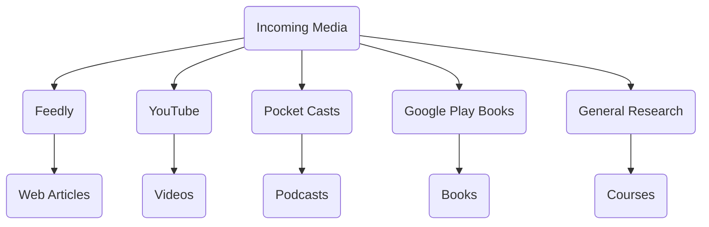
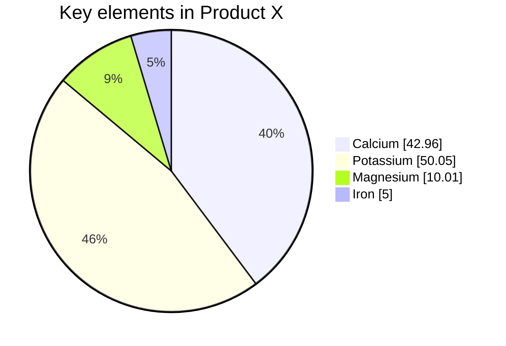

# Code
- `inline code`
#seedling 
#fern
#incubator
#evergreen
#backlog
#inprogress
#completed
#archieved
#book
#chapter
#course
#note
#blog
#word
#snippet
#code
#video
#person
#moc
#utility
#home
#plugin
#paper #article
#concept
#Justatag

```go
// This is a comment
package main
import "fmt"

func main(){
	fmt.Println("SOmething")
	var x = (56) + 3
	
}
```

---

$\int{1}{2}sin(x)$
> **dfd** d *ddd*

> This is the block qoute. some loerm bbbbbbbbbbbbbbb dfdfd ddddddddddddddddddddddddddddddddddddddddddddddddddddddddddddddddddddddddddddddd

- item 1
- item 2
	- nested
	- ntested 2
	- ntested 3
1. hey
2. second
	1. one 
	2. two
	3. three
		- som
		- so
		- s
1. something 

- [ ] item 1
- [ ] item 2

[[test]]






|     ID      | Docker Concepts (30) |              Project (60)               | Document(10) | Optional (30) | Total (100) |
|:-----------:|:--------------------:|:---------------------------------------:|:------------:|:-------------:|:-----------:|
| 40013161003 |          30          |                   60                    |      10      |       5       |     105     |
| 40013184005 |          30          |                   60                    |      10      |       0       |     100     |
| 40013161001 |          25          |                   60                    |      10      |       0       |     95      |
| 40034358001 |          25          |                   50                    |      10      |       0       |     85      |
| 9933161001  |          15          |                   50                    |      10      |       0       |     75      |
| 40013161002 |          60          | - No Project, exam from Docker concepts |      -       |       -       |     60      |
| 40013184002 |          25          |                   45                    |      10      |       0       |     80      |

```dataview
table Q
```